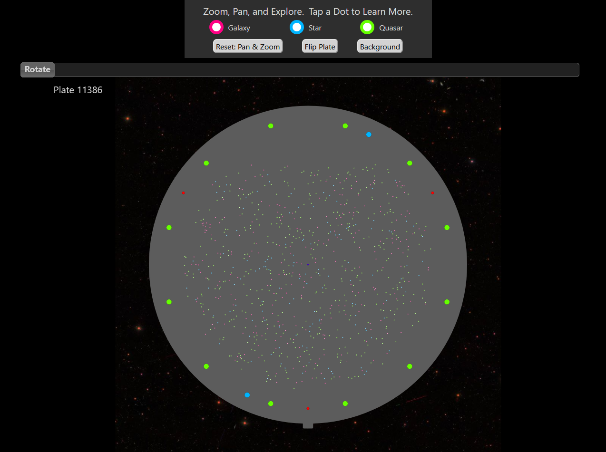
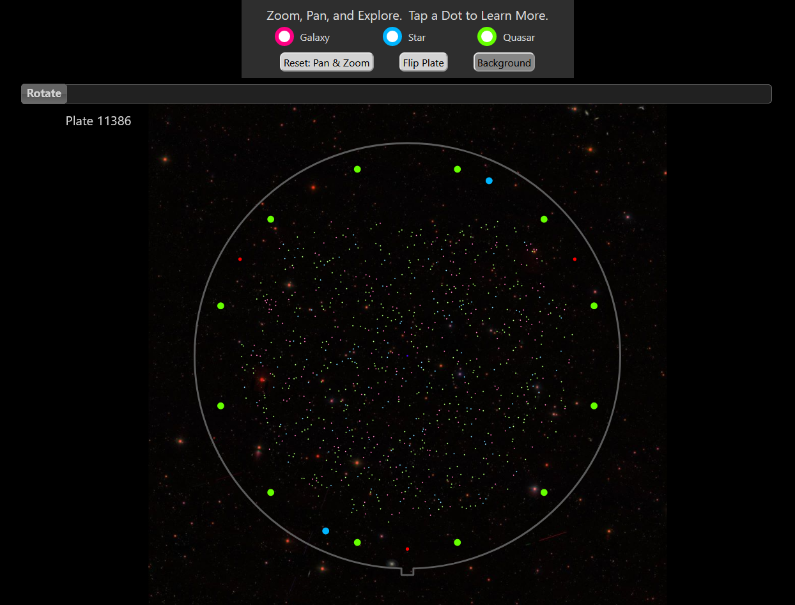
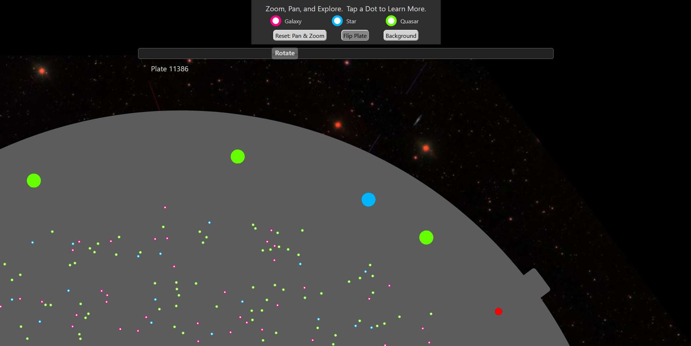

# **PlateMaker**
Project Initiated: 2021-12-12<br/>
Updated: 2022-04-23

## **Deployed Project Example Link**
https://codingmoore.github.io/Galactic-Ping-Pong/plates/openSeaDragonTest-11386.html
<br/>

## **Project Description**

### **This project is a work in progress**

This is a C# console application that generates mobile friendly, interactive digital versions of "[SDSS Plates](https://voyages.sdss.org/preflight/sdss-plates/)" as self-contained HTML files.

SDSS Plates are 31" diameter, 1/8" thick aluminum disks, each with 640-1000 small holes drilled into them. Each hole corresponds to a real galaxy, star, or quasar.  The scientists of the Sloan Digital Sky Survey mount these plates into extremely large telescopes, allowing them to make accurate scientific observations about each object (as represented by a plate hole).  The scientist can use this collective data to help map out the universe.

After data has been gathered using these plates, they are retired from service and given to artists and educators.  These artist and educators can display and share these plates in a myriad of creative and artistic ways. However the plates themselves do not give any indication of what they are, or what they were used for. 

To help connect the physical plate with the science work that it was used for, people can use this application to generate a digital version of any SDSS plate by simply inputting the number stamped onto the plate.  This app uses an API to fetch information about the plate, and creates a self-contained HTML file, that when when opened by a web browser, will allow the user to pan, zoom, rotate, and flip the plate digitally.  All of the 640-1000 small holes on the digital plate are links to the SDSS website, which clicked or tapped, opens new window with scientific information related to the specific galaxy, star, or quasar that the hole represents.

To include these interactive, digital plates with the owner's artwork or presentation, they only need to use the app to generate a plate HTML file, save the file in a publicly shared folder somewhere, and share the link to that file's location.  (A QR code sticker next to the artwork would be a great way to go) 

To see an example of how these HTML files can be used in a webpage, please see my "[Galactic-Ping-Pong](https://github.com/CodingMoore/Galactic-Ping-Pong)" project -- A mobile friendly companion webpage for visitors to the "Galactic-Ping-Pong" art show (Artwork by [Katheryn Cellerini Moore](https://kmoostudios.com)). (This project uses an older version of the plate files, and does not have a rotation option.)

<br/>

## **Screenshots**
<br/>

&emsp;
<br/>


<br/>
<br/>

## **Required for Use**
* A mobile or desktop browser that can run HTML5.

<br/>

## **Installation Instructions**

### **Option 1** (direct download)

Copy and paste the following GitHub project link into your web browser's url bar and hit enter/return.

https://github.com/CodingMoore/PlateMaker

Download a .zip copy the repository by clicking on the large green "Code" button near the upper right corner of the screen.

Right click the .zip file and extract (unzip) it's contents.

Open the unzipped folder/files using Visual Studio (or similar source code editing program that can compile C#).

Open the "**Program.cs**" file in the "**PlateMaker.csproj**" file.

Replace the value of the "**csvImportDirectory**" constant at the top of the file, with the file path to the project's "**Images**" folder.

In your file explorer, navigate to the "Images" directory and open the .csv file using a spreadsheet program.  Starting in the first column, second row, vertically list all of the plate numbers that you would like to generate HTML files for, and save the file.

Build the project and run it using Visual Studio (or similar source code editing program that can compile C#).

The HTML files should be generated and stored in the project's "html File" folder.

### **Option 2** (via git console/terminal)

Open your Git enabled terminal/console and navigate to a directory that you wish to download this project to.

Type the following line of code into your terminal/console to automatically download the project to your current directory and hit return/enter.
```
git clone https://github.com/CodingMoore/PlateMaker
```

Once the project has finished downloading, use Visual Studio (or similar source code editing program that can compile C#) to open the project.

Open the "**Program.cs**" file in the "**PlateMaker.csproj**" file.

Replace the value of the "**csvImportDirectory**" constant at the top of the file, with the file path to the project's "**Images**" folder.

In your file explorer, navigate to the "Images" directory and open the .csv file using a spreadsheet program.  Starting in the first column, second row, vertically list all of the plate numbers that you would like to generate HTML files for, and save the file.

Build the project and run it using Visual Studio (or similar source code editing program that can compile C#).

The HTML files should be generated and stored in the project's "html File" folder.
<br/>

## **Known Bugs**
This is still a work in progress and full functionality is not yet present.
<br/>

## **Planned Updates**
A previous version of this project was working, and generated HTML plate files for my "[Galactic-Ping-Pong](https://github.com/CodingMoore/Galactic-Ping-Pong)" project using the "panzoom-only" branch of this project.  The "panzoom-only" branch uses the panzoom library, which I did not have set up for rotating the image.  

I am currently building out a newer version of this application that replaces the panzoom library with the OpenSeadragon library. While panzoom is easy to use, and is effective, it critically does not have the ability so support "deep zooming" of high resolution "tiled" images.  Ultimately, I would like to be able to replace the relatively low resolution background images for each plate, with extremely high resolution tiled images.  This would allow the user to zoom into the plate image far enough to clearly see the object that the any given hole (dot) represents.
<br/>

## **Technology Used**

__Programming Software:__<br/>
* HTML<br/>
* JavaScript<br/>
* CSS<br/>
* Bootstrap<br/>
* jQuery<br/>
* jQuery UI (library) - Used for the plate rotation slider<br/>
* [jQuery UI Touch Punch](https://github.com/furf/jquery-ui-touch-punch) (plugin) - Adds touch funtionality to the plate rotation slider<br/>
* [panzoom](https://github.com/timmywil/panzoom) (library)<br/>
* [OpenSeadragon](https://openseadragon.github.io/) (library)<br/>
* [SVG Overlay for OpenSeadragon](https://github.com/openseadragon/svg-overlay) (plugin) - Add support for .svg image overlays<br/>
<br/>

__Other Software:__<br/>
* [Affinity Designer](https://affinity.serif.com/en-us/designer/) - Used to create the out elements of the plate .svg files. 

<br/>

## **Authors and Contributors**
**Authored by:** Randel Moore

<br/>

## **Acknowledgements**
**Plate Background Images Credit:** [Sloan Digital Sky Survey](https://www.sdss.org/)<br/>
**Plate Data Credit:** [Sloan Digital Sky Survey](https://www.sdss.org/)

<br/>

## **Contact**
CodingMoore@gmail.com

<br/>

## **License**

GPLv3

Copyright © 2022 Randel Moore